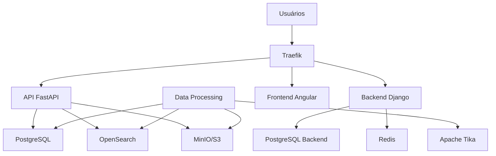

# Arquitetura do Querido Diário Deployment

## Visão Geral da Infraestrutura

O sistema de deployment do Querido Diário orquestra uma plataforma completa 
de transparência pública através de containers Docker, com suporte a dois 
ambientes principais: desenvolvimento local e produção distribuída.

## Componentes da Plataforma



## Perfis de Deployment

### Profile: `dev` (Desenvolvimento)
```yaml
# Infraestrutura 100% local
services:
  postgres:     # Container local
  opensearch:   # Container local  
  minio:        # Container local
  redis:        # Container local
  
  api:          # Conecta na infra local
  backend:      # Conecta na infra local
  
  traefik:      # HTTP, sem SSL
```

### Profile: `prod` (Produção)
```yaml
# Infraestrutura externa
services:
  api:          # Conecta em PostgreSQL/OpenSearch externos
  backend:      # Conecta em PostgreSQL/Redis externos
  
  traefik:      # HTTPS com Let's Encrypt
```

### Profile: `processing` (Processamento)
```yaml
services:
  data-processing:  # Jobs de ETL
  apache-tika:      # Extração de texto
```

## Fluxo de Configuração

### Desenvolvimento
1. `make dev` → Gera `.env` com configurações locais
2. Docker Compose usa profile `dev`
3. Todos os serviços sobem em containers locais
4. Traefik configura roteamento HTTP
5. Domínio local: `queridodiario.local`

### Produção  
1. `make setup-env-prod` → Gera `.env` do template
2. Administrador configura variáveis externas
3. Docker Compose usa profile `prod`
4. Traefik obtém certificados SSL automaticamente
5. Serviços conectam em infraestrutura externa

## Padrões de Rede

### Networks
- **frontend**: Externa, compartilhada com Traefik
- **backend**: Interna, comunicação entre serviços

### Roteamento Traefik
```yaml
# Padrão de labels para roteamento
labels:
  - "traefik.http.routers.${SERVICE}.rule=Host(`${SERVICE}.${DOMAIN}`)"
  - "traefik.http.routers.${SERVICE}.tls.certresolver=leresolver"
```

## Gerenciamento de Estado

### Volumes Persistentes
- `postgres-data`: Dados do PostgreSQL (dev)
- `opensearch-data`: Índices de busca (dev) 
- `minio-data`: Arquivos de gazetas (dev)
- `redis-data`: Cache e filas (dev)
- `static-files`: Assets estáticos
- `traefik-acme`: Certificados SSL

### Configuração via Environment
- Templates em `templates/env.prod.sample`
- Interpolação Docker Compose: `${VAR}`
- Separação dev/prod por variáveis

## Automação via Makefile

### Comandos Principais
- `make dev`: Ambiente completo de desenvolvimento
- `make prod`: Deploy de produção
- `make validate`: Validação de sintaxe
- `make logs-{service}`: Logs específicos
- `make shell-{service}`: Acesso aos containers

### Padrões de Targets
```makefile
# Targets com documentação
target: ## Descrição do que faz
    @echo "🔄 Executando ação..."
    comando

# Targets parametrizados  
logs-%: ## Logs de serviço específico
    docker compose logs -f $*
```

## Estratégias de Monitoramento

### Health Checks
Todos os serviços críticos implementam health checks:

```yaml
healthcheck:
  test: ["CMD-SHELL", "curl -f http://localhost/health"]
  interval: 30s
  timeout: 10s
  retries: 3
  start_period: 40s
```

### Observabilidade
- Logs centralizados via Docker Compose
- Traefik dashboard para métricas de proxy
- Health endpoints em todos os serviços